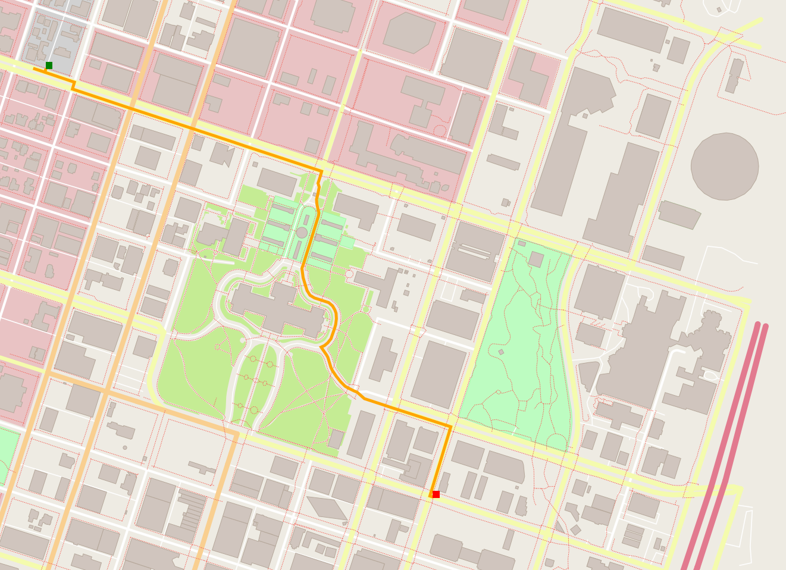

# OSM Route Planner
 OSM Route Planner uses **A\* search algorithm** to find the shortest path between 2 points on a map. Currently, it parses OSM (OpenStreetMap) data where starting point and destination (start_node & end_node) coordinates are provided by the end user. It uses [pugixml](https://pugixml.org/) library to parse OSM data into xml format and uses io2d library (check [P0267 Reference Implementation](https://github.com/cpp-io2d/P0267_RefImpl)) to render a route on map to the display. Render here means transformation of ideal representation into pixels. This project is a part of Udacity C++ Nanodegree and is tested against unit tests (via [GoogleTest Framework](https://github.com/google/googletest)) present in [test](https://github.com/compilepeace/OSM_Route_Planner/blob/main/test/utest_rp_a_star_search.cpp) directory.

 

## Cloning

When cloning this project, be sure to use the `--recurse-submodules` flag. Using HTTPS:
```
git clone https://github.com/compilepeace/OSM_Route_Planner --recurse-submodules
```
or with SSH:
```
git clone git@github.com:compilepeace/OSM_Route_Planner.git --recurse-submodules
```

## Dependencies for Running Locally
* cmake >= 3.11.3
  * All OSes: [click here for installation instructions](https://cmake.org/install/)
* make >= 4.1 (Linux, Mac), 3.81 (Windows)
  * Linux: make is installed by default on most Linux distros
  * Mac: [install Xcode command line tools to get make](https://developer.apple.com/xcode/features/)
  * Windows: [Click here for installation instructions](http://gnuwin32.sourceforge.net/packages/make.htm)
* gcc/g++ >= 7.4.0
  * Linux: gcc / g++ is installed by default on most Linux distros
  * Mac: same instructions as make - [install Xcode command line tools](https://developer.apple.com/xcode/features/)
  * Windows: recommend using [MinGW](http://www.mingw.org/)
* IO2D
  * Installation instructions for all operating systems can be found [here](https://github.com/cpp-io2d/P0267_RefImpl/blob/master/BUILDING.md)
  * This library must be built in a place where CMake `find_package` will be able to find it. Installing it system-wide will always do fine.

### Installing  IO2D on Linux
If you encounter any issues installing io2d library from above mentioned link on Linux (even after installing **io2d's dependencies**), follow the below given steps.

1. `git clone --recurse-submodules https://github.com/cpp-io2d/P0267_RefImpl`

2. Go to `P0267_RefImpl/Samples/svg/external` and 
delete `svgpp` directory.

3. go to `https://github.com/svgpp/svgpp` and clone this repo in place of the old svgpp folder , i.e in `/P0267_RefImpl/Samples/svg/external/`

4. Add 2 statements inside `thirdparty/P0267_RefImpl/CMakeLists.txt` - `set(IO2D_WITHOUT_SAMPLES 1)` & `set(IO2D_WITHOUT_TESTS 1)` to ensure that we do not build samples and tests.

5. Now, to install io2d library system-wide, open terminal & type
 ```bash
cd /P0267_RefImpl 
mkdir Debug && cd Debug
cmake -S Debug "-DCMAKE_BUILD_TYPE=Debug" ..
cmake --build  .
make 
sudo make install
 ```

## Compiling and Running

### Compiling
To compile the project, first, create a `build` directory and change to that directory:
```
mkdir build && cd build
```
From within the `build` directory, then run `cmake` and `make` as follows:
```
cmake ..
make
```
### Running
The executable will be placed in the `build` directory. From within `build`, you can run the project as follows:
```
./OSM_A_star_search
```
Or to specify a map file:
```
./OSM_A_star_search -f ../<your_osm_file.osm>
```

## Testing

The testing executable is also placed in the `build` directory. From within `build`, you can run the unit tests as follows:
```
./test
```

## Troubleshooting
* Some students have reported issues in cmake to find io2d packages, make sure you have downloaded [this](https://github.com/cpp-io2d/P0267_RefImpl/blob/master/BUILDING.md#xcode-and-libc).
* For MAC Users cmake issues: Comment these lines from CMakeLists.txt under P0267_RefImpl
    ```
    if( NOT DEFINED IO2D_WITHOUT_SAMPLES )
	     add_subdirectory(P0267_RefImpl/Samples)
    endif()
    ```
    And then run "ALL_Build" and "install" in XCode.
    
    If any packages are missing try to install packages using 
    ```
    brew install pkg-config
    ```
 * For Ubuntu Linux IO2D installation errors, follow the given steps:
   ```
	sudo apt update
	sudo apt install build-essential
	sudo apt install cmake
	sudo apt install libcairo2-dev
	sudo apt install libgraphicsmagick1-dev
	sudo apt install libpng-dev

	git clone --recurse-submodules https://github.com/cpp-io2d/P0267_RefImpl
	cd P0267_RefImpl
	mkdir Debug
	cd Debug
	cmake --config Debug "-DCMAKE_BUILD_TYPE=Debug" ..
	cmake --build .
	sudo make install
   ```
     
 * If you are working on windows and unable to install IO2D:
      * Enable WSL (Windows Subsystem for Linux) and use a distribution like [Ubuntu](https://ubuntu.com/wsl).(available from the windows store): 
      * Install the required dependencies (compiler, cmake etc.) in the WSL(as mentioned above for ubuntu)
      * Configure CLion to use the WSL [toolchain](https://www.jetbrains.com/help/clion/how-to-use-wsl-development-environment-in-product.html#wsl-tooclhain)
      * Use the WSL toolchain to build the project
      * If you are still facing errors, visit this [link](https://github.com/udacity/CppND-Route-Planning-Project/issues/9).
     

* If you are facing errors with --config try to remove -- from the command.


